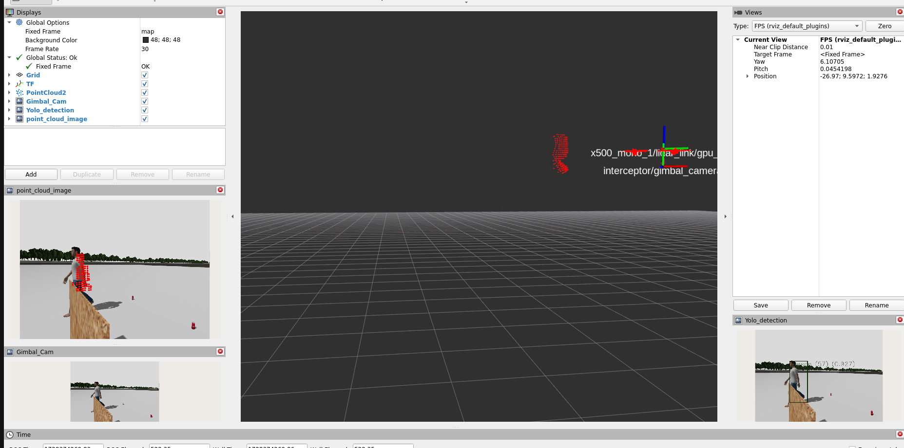
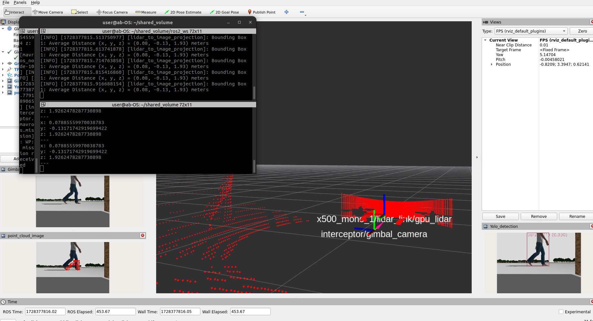

# ROS2 Camera-Lidar Fusion Package

## Description

This ROS2 package fuses 360-degree lidar and camera data for enhanced object tracking. It transforms lidar point clouds from the lidar frame to the camera frame and overlays the points within detected object bounding boxes onto the image. The system estimates 3D positions by averaging the point cloud (x, y, z) within each bounding box, enabling real-time tracking and position estimation for multiple objects simultaneously.

---

## Table of Contents
1. [Features](#features)
2. [Demonstration](#demonstration)
3. [Installation](#installation)
4. [Usage](#usage)
5. [Node](#node)
6. [Contributing](#contributing)

---
## Demonstration

### Lidar-Camera Fusion in Action

<p align="center">
  
  
</p>

<p align="center">
  
</p>

---

## Features

- **Lidar to Camera Frame Transformation**: Fuse lidar point cloud data into the camera reference frame.
- **Object Detection Overlay**: Overlays lidar points corresponding to detected objects (within bounding boxes) onto the camera image.
- **3D Position Estimation**: Calculates the average (x, y, z) of point clouds within object bounding boxes to estimate 3D positions.
- **Multi-Object Tracking**: Simultaneously tracks and estimates positions for multiple detected objects in real-time.
- **ROS2 Integration**: Fully compatible with ROS2 for seamless integration in robotics applications.
  
---

## Installation

### Prerequisites
- **ROS2 Humble**: Ensure you have ROS2 Humble installed on your machine. [Installation Guide](https://docs.ros.org/en/humble/Installation.html)
- **YOLOvX**: Follow the instructions to set up YOLOvX in ROS2 for object detection. [Installation Guide](https://github.com/mgonzs13/yolov8_ros) 

### Clone the Repository
```bash
cd ~/ros2_ws/src
git clone https://github.com/yourusername/ros2_lidar_camera_fusion_with_detection.git
```
### Install Dependencies
Run `rosdep` to install any missing dependencies:
```bash
cd ~/ros2_ws
rosdep install --from-paths src --ignore-src -r -y
```
### Build the Package
After cloning and installing dependencies, build your package:
```bash
colcon build --packages-select ros2_lidar_camera_fusion_with_detection
```
---

## Usage

### Modifying the Code for Your Setup
Before running the package, make sure to modify the following parts of the code in `lidar_camera_fusion_with_detection.py` to match your setup:


1. **Specify the Image Dimensions**: Set the correct image width and height according to your camera's resolution.
   Example:
   ```python
   # Define image width and height
   image_width = 640
   image_height = 480
   ```
2. **Set the Transformation Matrix**: Update the transformation matrix between the Lidar and the camera based on your setup.
   Example:
   ```python
    # Transformation Matrix Between the Lidar and the Camera
    T_lidar_to_camera = np.array([
    [0, -1, 0, 0.1],  # Modify this matrix based on your setup
    [0, 0, -1, 0],
    [1, 0, 0, 0],
    [0, 0, 0, 1]
    ])
   ```
3. **Specify the Distance Range**: Set the distance range for points that should be transformed. In this example, only points between 0.5 and 10 meters are considered.
   Example:
   ```python
    # Check if x, y, or z are finite and filter based on the desired distance range
    if math.isfinite(x) and math.isfinite(y) and math.isfinite(z) and 0.5 < x < 10:
    # Apply transformation
   ```
### Build the Package
After modifying the code, build your package:
```bash
cd ~/ros2_ws
colcon build --packages-select ros2_lidar_camera_fusion_with_detection
```
### Source the Workspace
Before running the package, ensure you source the workspace to have access to the built packages:

For **Bash**:
```bash
source ~/ros2_ws/install/setup.bash
```

### Run the Node
To run the package with your custom launch file (make sure you specify it):
```bash
ros2 run ros2_lidar_camera_fusion_with_detection lidar_camera_fusion_with_detection
```

---
## Node

### `lidar_camera_fusion_node`

This node fuses lidar point cloud data onto the camera image frame and overlays the points within detected object bounding boxes onto the image.

#### Subscribed Topics:

-**`/scan/points`**: Lidar point cloud data.

-**`/interceptor/gimbal_camera`**: Camera image output.

-**`/interceptor/gimbal_camera_info`**: Camera info for the Camera Intrinsic.

-**`/yolo/tracking`**: Detected objects with bounding boxes.


#### Published Topics:

-**`/image_lidar`**: Image with projected Lidar points.

-**`/detected_object_distance`**: Average distance to the detected objects with respect to the camera frame.

---
## Contributing

Feel free to contribute to this project by creating pull requests or opening issues.
